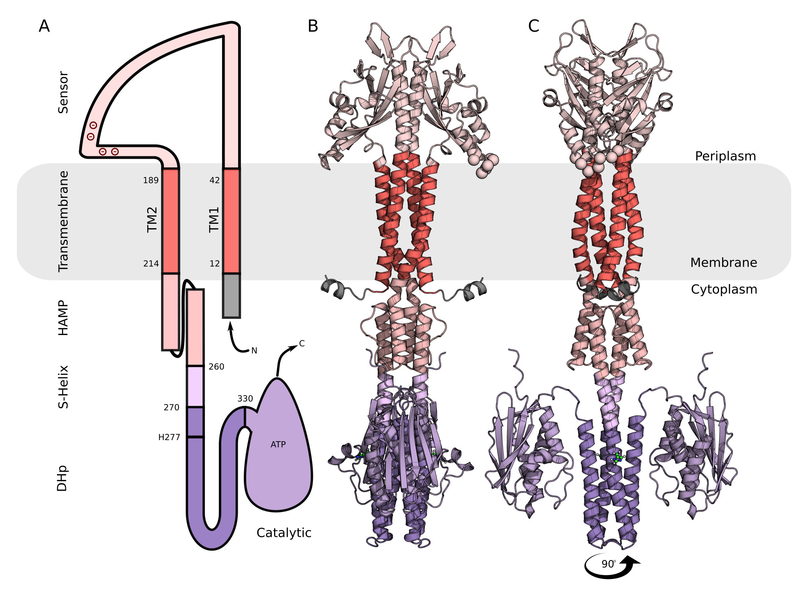

   

  

<h1 style="text-align: center;">
    Atomic insights into the signaling landscape of <em>E. coli</em> PhoQ Histidine Kinase from Molecular Dynamics simulations
</h1>

# The Adventure of Unraveling PhoQ: Our Scientific Quest

### Introduction
In the ever-fascinating world of molecular biology, the PhoQ histidine kinase protein is like a hidden treasure waiting to be discovered. Our journey to decode the secrets of PhoQ is a tale of curiosity, teamwork, and a lot of late-night brainstorming sessions. Here’s the story of how a passionate PhD student, a visionary professor, and an expert from Germany embarked on this scientific adventure.

### The Beginning
It all started at the University of Bern, Switzerland. I was a PhD student working under the guidance of Professor Thomas Lemmin. The spark for this project came from Professor Lemmin's groundbreaking PhD thesis, which delved into the mysteries of two-component systems (TCSs) in bacteria. His enthusiasm was contagious, and soon, I found myself deeply immersed in the world of PhoQ.

Our team got a significant boost when Dr. Jing Juan from the Max Planck Institute for Terrestrial Microbiology in Germany joined us. Dr. Juan is an expert in protein interactions, particularly how histidine kinase proteins like PhoQ interact with small peptides. Her expertise was the perfect complement to our team, and we were ready to dive into the unknown.

### Discovering PhoQ's Role
PhoQ is a histidine kinase protein that acts as a sensor in the PhoQ/PhoP two-component system. This system helps bacteria adapt to their environment, detecting changes like magnesium ion levels, acidic conditions, and the presence of antimicrobial peptides. When activated, PhoQ undergoes a change, triggering a chain reaction that alters gene expression and bacterial behavior.

### Our Approach: Blending Tech and Biology
To unravel PhoQ's secrets, we used a mix of cutting-edge technology and traditional molecular biology. We started with AlphaFold2 predictions and molecular modeling, followed by intense Molecular Dynamics (MD) simulations. This combo allowed us to peek into PhoQ's behavior in different states and identify key steps in its activation process.

The MD simulations revealed three distinct conformations of PhoQ, which we validated with experimental data. One particularly exciting discovery was a conformation where magnesium ions bridged the acidic patch in the sensor domain to the membrane, likely representing a repressed state. We also observed high hydration in a potential intermediate state, supporting the idea of water playing a role in PhoQ's signaling.

Overcoming Challenges and Celebrating Wins
Our journey wasn’t always smooth. We faced numerous challenges, from ensuring our models were accurate to running extensive simulations. Each phase of the project brought its own set of hurdles, but our team's determination kept us going.

Despite the challenges, our collaborative efforts paid off. The insights we gained not only shed light on PhoQ's specific activation pathway but also provided broader implications for understanding the entire histidine kinase family. Our findings are paving the way for future research and potential new treatments targeting PhoQ modulation.

### Looking Ahead
This project wouldn’t have been possible without the unwavering support of Professor Thomas Lemmin. His visionary ideas and mentorship were the backbone of our research. I’m also incredibly grateful to Dr. Jing Juan for her expertise and collaborative spirit, which enriched our work and broadened our horizons.

As we look to the future, our team is excited to further explore how PhoQ interacts with small peptides and antimicrobial agents. The models we've generated open new doors for studying PhoQ's interactions and developing innovative therapeutic strategies to combat bacterial infections.

### Conclusion
The adventure of uncovering PhoQ is a testament to the power of teamwork and curiosity. It highlights the importance of interdisciplinary collaboration and the relentless pursuit of knowledge. As we continue our quest, we're committed to advancing molecular biology and finding new solutions to global health challenges.

