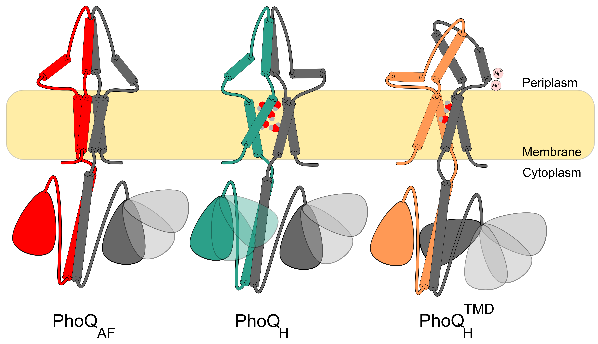
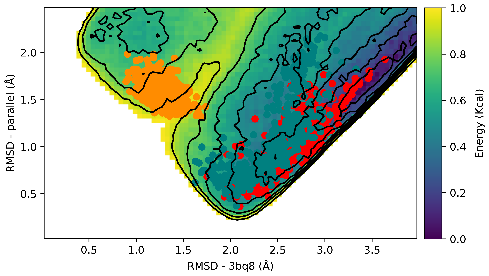

   

  

<h1 style="text-align: center;">
    Behind the paper: A computational exploration of the complex world of PhoQ signaling
</h1>

### Introduction
The rise of antibiotic-resistant bacteria poses a severe threat to global health, with millions affected each year. Despite significant research efforts, the discovery of new antibiotic classes has been challenging, leaving us in a critical need for innovative approaches. Furthermore, developing effective antibiotics is only part of the solution. To truly combat bacterial infections, we must also understand how these pathogens perceive and respond to their environment.
Bacteria employ sophisticated systems to sense and adapt to their surroundings. Among these, two-component systems (TCS) are pivotal. These regulatory systems typically consist of a sensor histidine kinase located in the cytoplasmic membrane and a response regulator in the cytoplasm. The sensor detects environmental stimuli, triggering a phosphorylation cascade that ultimately modulates gene expression.

PhoQ is a quintessential example of a histidine kinase that serves as a sensor in the PhoQ/PhoP TCS. This system is crucial for bacterial survival and virulence, as it orchestrates responses to a variety of environmental stressors, including magnesium limitation, acidic pH, and the presence of antimicrobial peptides. However, the precise molecular signaling mechanism of PhoQ has remained elusive due to the lack of detailed atomic-level structural information.

Our journey to decode the secrets of PhoQ signaling is a tale of curiosity, teamwork, and a lot of late-night brainstorming sessions.

### The beginning
It all started at the University of Bern, Switzerland, where I am a PhD student working under the guidance of Professor Thomas Lemmin. Integral membrane proteins like PhoQ are notoriously difficult to study experimentally, making computational modeling an invaluable tool for understanding their structure and function. During his own PhD, Thomas had produced a high-resolution structural model of PhoQ's transmembrane domain, but constructing a full-length protein structure remained an elusive goal.

The spark for this project was first ignited with the release of AlphaFold2-multimer. Collaborating with Dr. Jing Yuan from the Max Planck Institute for Terrestrial Microbiology, a leading expert on histidine kinases and regulation mechanisms of small proteins, was the catalyst we needed. Jing's expertise, in conjunction with Thomas' foundational work, kindled the flame that illuminated our path into the unknown. Their shared enthusiasm was infectious, and soon I found myself fully immersed in the intriguing world of PhoQ, eager to uncover its secrets.

### Our approach: Integrating Deep learning and Biology

While the AlphaFold2-multimer model provided a promising overall structure, we encountered inconsistencies with experimental data, particularly at the sensor domain interface. To address these discrepancies, we turned to molecular dynamics simulations to investigate the protein's dynamics. Our initial attempts to induce conformational changes in the sensor domain were unsuccessful.

  

  <small>(A) Schematic representation of PhoQ topology.  (B) Cartoon representation of the predicted PhoQ structure using AlphaFold2. Transmembrane domains (red), sensor and HAMP domains (shades of pink), and DhP and catalytic domains (shades of purple) are indicated. The membrane is depicted as a gray rectangle.</small>

A breakthrough came with the integration of Thomas' model of the transmembrane domain. Although this model diverged significantly from the AlphaFold2 transmembrane predictions, it fit seamlessly with the rest of the structure. This modification allowed us to successfully open the sensor domain interface. Furthermore, our simulations offered unprecedented molecular insights into magnesium ion binding and membrane domain hydration, which have been crucial yet elusive aspects of signaling for over a decade.

Through extensive simulations, we identified three distinct PhoQ conformations, all of which were validated by experimental data. One particularly notable conformation featured magnesium ions bridging the sensor domain’s acidic patch to the membrane, along with moderate membrane hydration, suggesting a repressed state. Additionally, we observed a highly hydrated intermediate state, providing new support for the hypothesis that water plays a significant role in PhoQ signaling.

  

  <small>Cartoon representation of PhoQ's states (A) active state (B) intermediate state (C) partially repressed state.</small>

To further explore the energetic landscape of PhoQ signaling, we employed metadynamics simulations to characterize transitions between the identified states. However, despite promising initial results, these simulations consistently encountered challenges with protein stability, particularly unfolding at the sensor-transmembrane domain interface.

  

  <small>landscape of metadynamics simulations overlayed by the simulations trajectories of the active state(red), intermediate state (teal), and partially repressed state (orange).</small>

Despite the challenges, our collaborative efforts paid off. The insights we gained not only shed light on PhoQ's specific activation pathway but also provided broader implications for understanding the entire histidine kinase family. Our findings are paving the way for future research and potential new treatments targeting PhoQ modulation.

### Looking Ahead
As we look to the future, we are excited to further explore how PhoQ interacts with small peptides and antimicrobial agents. The models we have generated open new doors for studying PhoQ's interactions and developing innovative therapeutic strategies to combat bacterial infections.
